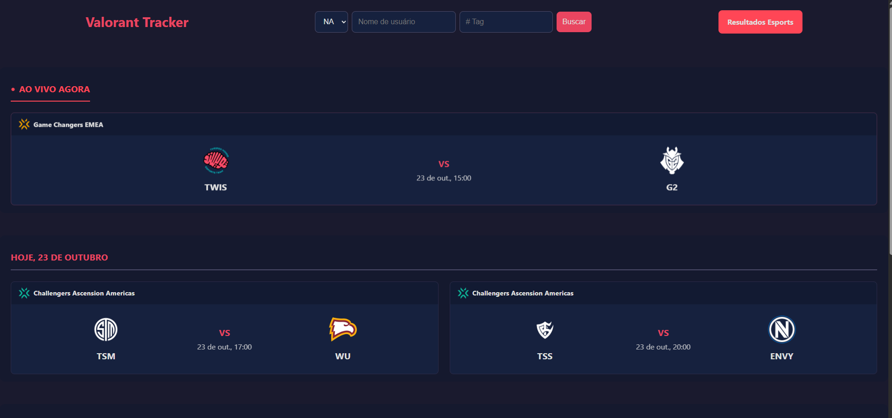
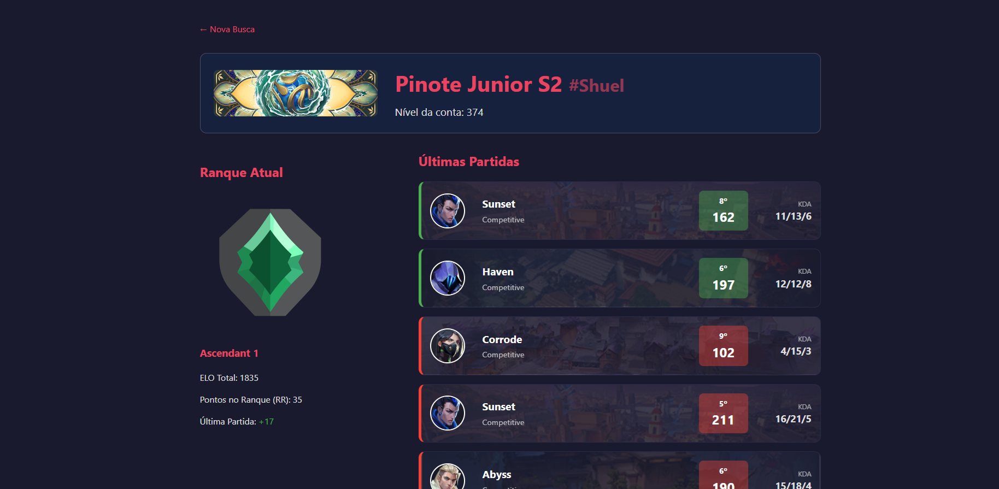
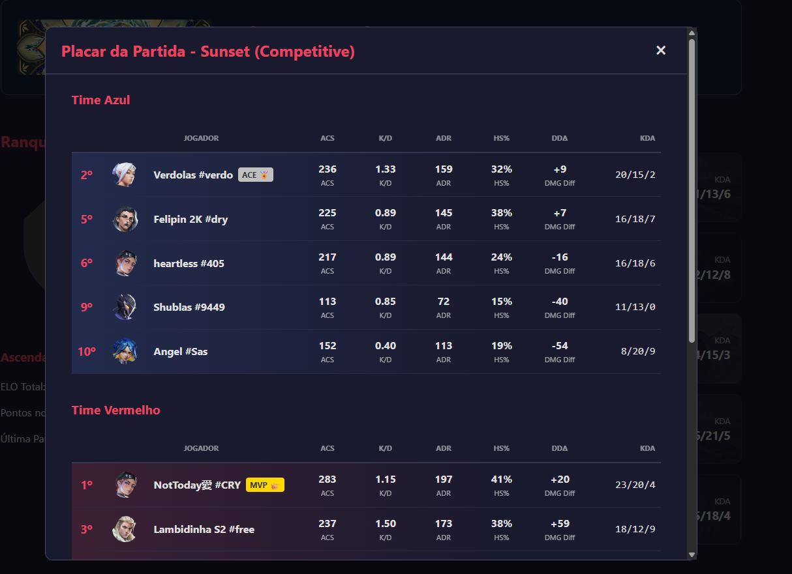
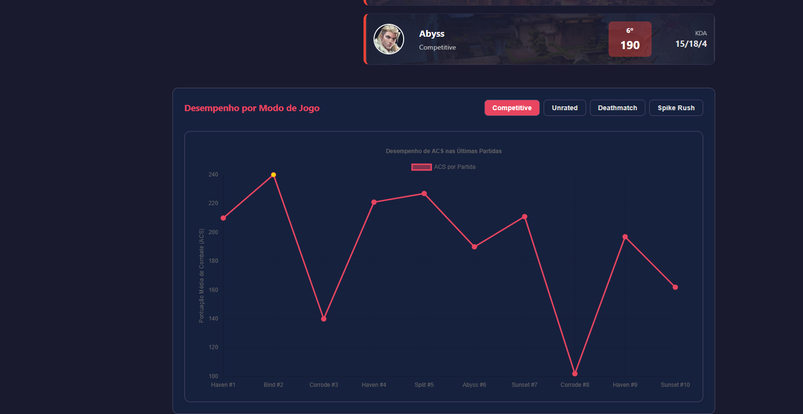
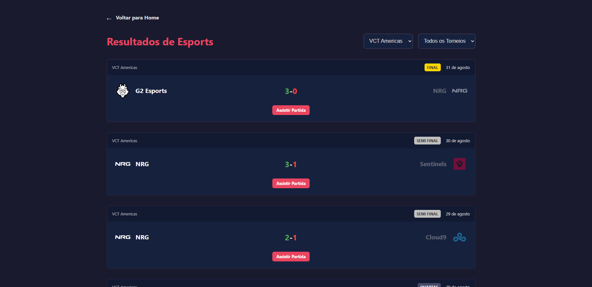

# Valorant Tracker 🎮📊

Um tracker de estatísticas e resultados de esports para Valorant, construído com React, Node.js e TypeScript. Este projeto nasceu de conversas com amigos jogadores e foi desenvolvido como um projeto de aprendizado e demonstração de habilidades full-stack.

[](https://valorant-tracker-beta.vercel.app/)

**🔗 Acesse a aplicação:** https://valorant-tracker-beta.vercel.app/

---

## ✨ Sobre o Projeto

Este projeto é um tracker web para o jogo Valorant. A ideia surgiu da minha paixão pelo jogo e de conversas com amigos sobre funcionalidades que gostaríamos de ter para analisar nosso desempenho e acompanhar o cenário competitivo

O objetivo principal foi criar uma aplicação full-stack funcional e visualmente agradável, utilizando tecnologias modernas e explorando o consumo de APIs externas (HenrikDev API).

---

## 📸 Screenshots

* **Homepage (Busca e Agenda):**
    
* **Página do Jogador (Stats e Gráfico):**
    
* **Modal de Detalhes da Partida:**
    
* **Gráfico de Desempenho:**
    
* **Página de Resultados de Esports:**
     --- ---

## 🚀 Funcionalidades Principais

* **Busca de Jogador:** Encontre jogadores por Riot ID (Nome#Tag).
* **Perfil do Jogador:** Exibe o card do jogador, nível da conta, ranque atual (MMR) e ELO.
* **Histórico de Partidas Recentes:** Lista as últimas 5 partidas com visual detalhado (Mapa, Modo, Agente, KDA, ACS, Classificação da Partida, MVP/Hard Carry).
* **Modal de Detalhes da Partida:** Ao clicar em uma partida, abre um placar completo com:
    * Ranking de todos os 10 jogadores.
    * Ícone do Agente, Nome, Tag.
    * Estatísticas detalhadas (ACS, K/D, ADR, HS%, DDΔ).
    * Identificação de MVP e Destaque do time perdedor.
    * Dicas para o agente utilizado pelo jogador buscado e exemplos de composições competitivas.
* **Gráfico de Desempenho:** Gráfico de linha mostrando a evolução do ACS (Pontuação Média de Combate) do jogador nas últimas partidas, com filtros por modo de jogo (Competitivo, Unrated, etc.).
* **Página de Resultados de Esports:** Exibe os resultados das partidas profissionais concluídas, com filtros por Liga (VCT Americas, EMEA, etc.) e Torneio (Stage 1, Playoffs, Final).
* **Agenda de Esports na Home:** Mostra as partidas AO VIVO, de HOJE e de AMANHÃ.
* **Termos de Uso:** Implementação de uma tela de aceite de termos usando `localStorage` para persistência.

---

## 🔧 Tecnologias Utilizadas

**Frontend:**
* React (com Vite)
* TypeScript
* Styled-Components
* React Router DOM (Roteamento)
* Chart.js (Gráficos)
* Axios (Requisições HTTP)

**Backend:**
* Node.js
* Express.js (Framework)
* Axios (Requisições HTTP)
* Dotenv (Variáveis de ambiente)
* Node-Cache (Cache de API)
* Cors (Controle de Acesso)

**API Externa:**
* HenrikDev Valorant API (Dados do jogo, jogadores e esports)

**Deploy:**
* Frontend: Vercel
* Backend: Render

---

## ⚙️ Como Rodar Localmente

**Pré-requisitos:**
* Node.js (v18 ou superior recomendado)
* npm ou yarn
* Uma chave de API da [HenrikDev](https://henrikdev.xyz/) (obtida via Discord)

**Instruções:**

1.  **Clone o repositório:**
    ```bash
    git clone [https://github.com/seu-usuario/valorant-tracker.git](https://github.com/seu-usuario/valorant-tracker.git)
    cd valorant-tracker
    ```

2.  **Configure o Backend:**
    * Navegue até a pasta do backend: `cd backend`
    * Instale as dependências: `npm install`
    * Crie um arquivo `.env` na raiz da pasta `backend` com o seguinte conteúdo:
        ```env
        HENRIKDEV_API_KEY=SUA_CHAVE_HENRIKDEV_AQUI
        PORT=4000
        ```
    * Inicie o servidor backend: `npm run dev` (se configurou o nodemon) ou `node server.js`

3.  **Configure o Frontend:**
    * Abra um **novo terminal**.
    * Navegue até a pasta do frontend: `cd ../valorant-tracker-frontend`
    * Instale as dependências: `npm install`
    * Crie um arquivo `.env` na raiz da pasta `valorant-tracker-frontend` com o seguinte conteúdo:
        ```env
        VITE_API_BASE_URL=http://localhost:4000/api
        ```
    * Inicie o servidor de desenvolvimento do frontend: `npm run dev`

4.  **Acesse a aplicação:** Abra seu navegador em `http://localhost:5173` (ou a porta indicada pelo Vite).

---

## 🤝 Contribuições (Opcional)

Contribuições são bem-vindas! Se encontrar bugs ou tiver ideias para novas funcionalidades, sinta-se à vontade para abrir uma *Issue* ou um *Pull Request*.

---

## 📜 Licença (Opcional)

Este projeto é distribuído sob a licença MIT. Veja o arquivo `LICENSE` para mais detalhes.

---

*Desenvolvido com ❤️ e muita cafeína por Benny Nobre.*
